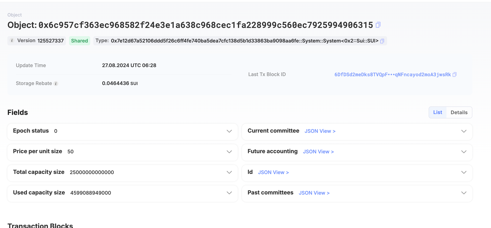
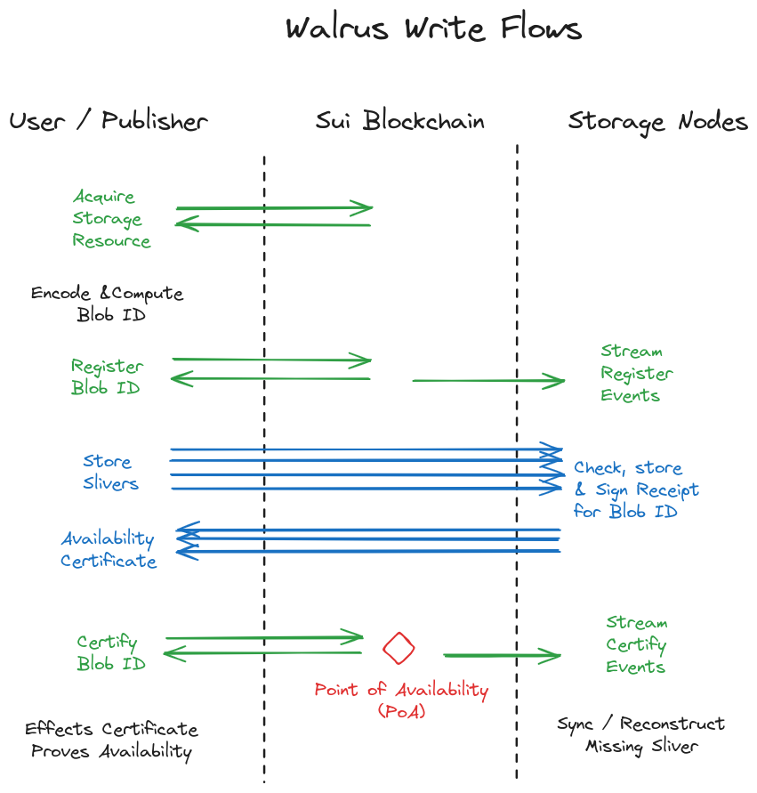

# Walrus 交互细节

根据前面介绍的架构部分，用户使用 Walrus 需要上传文件到存储节点，并通过 Sui 链协调同步，本节将详细介绍 Walrus 这些交互的细节。

## 链上交互

Walrus会在 Sui 链上存储 Blob的元数据，Blob 的内容始终存储在链外的 Walrus 存储节点或缓存上。存储节点或缓存不必与任何 Sui 基础设施组件（例如验证器）重叠，并且存储 epoch 可以具有不同的长度，并且可以不具有与 Sui 纪元相同的开始/结束时间。

简单理解就是会在链上存储简单的元数据来做数据与blob id之间的映射，下面是 Walrus 在 Sui 链上目前的[系统对象](https://suiscan.xyz/testnet/object/0x6c957cf363ec968582f24e3e1a638c968cec1fa228999c560ec7925994906315)：

### Sui 链上的存储生命周期

Walrus 通过一个[系统对象](https://testnet.suivision.xyz/object/0x6c957cf363ec968582f24e3e1a638c968cec1fa228999c560ec7925994906315)来存储众多公有的元数据，类似 Sui 链的0x1。

比如当前存储时期的存储节点委员会，总可用空间以及每单位存储的价格 (1 KiB)等，这些值由存储时期的存储节点之间的 2/3 协议确定。用户可以付费购买一段时间的存储空间。这些空间资源可以分割、合并、转移。

存储基金持有用于在一个或多个存储时期内存储 blob 的资金。当从系统对象购买存储空间时，用户需要支付多个存储周期内的存储基金。每个时期根据性能向存储节点付款。

用户通过合约或转让获取一些存储空间，并可以为其分配一个 Blob ID，表示他们希望将此 Blob ID 存储到其中。这会发出一个移动资源事件，存储节点会监听该事件以期望并授权链外存储操作。

最终，用户持有来自存储节点的 Blob ID 的链外可用性证书。用户将证书上传到链上，以表明 blob ID 在可用期内可用。该证书将根据最新的 Walrus 委员会进行检查，如果正确，则会针对 Blob ID 发出可用性事件。这是 blob 对象 的POA（point of availability）可用性点。

可以通过向经过认证的 blob 添加具有更长有效期的存储对象来扩展其存储。只要存在继续提供存储的资金，智能合约就可以使用此工具来扩展永久存储的 blob 的可用性。

写入 Walrus 的用户需要执行 Sui 事务来获取存储并验证 blob。创建或使用 Blob 可用性证明的用户读取链只是为了证明或验证事件的发出。节点在每个 epoch 中仅读取一次区块链以获取委员会元数据，然后通过 blob ID 直接从存储节点请求 sliver，以对 Walrus 资源执行读取。

### Walrus 在 Sui 链上的管理运作

每个 Walrus 存储 epoch 由 Walrus 系统对象表示，该对象包含存储委员会和各种元数据或存储节点，例如分片和存储节点之间的映射、可用空间和当前成本。

用户可以访问该时期的系统对象并购买一个或多个存储时期的一些存储量。在每个存储时期都有一个存储价格，并且所提供的付款成为跨越所购买的存储的所有存储时期的存储基金的一部分。未来可以购买存储的存储周期有最大数量（大约 2 年）。存储是一种可以分割、合并、转移的资源。

在存储 epoch 结束时，需要将存储基金中的部分资金分配给存储节点。这里的想法是让存储节点相互执行轻度审计，并根据这些审计的性能建议哪些节点应该得到报酬。

## 链下交互

Blob id 存入链上，还需要将blob对象在链下存入节点，下面是 Walrus 的一个上传文件流程图：

如上图所示：
  - 用户可以通过直接在 Walrus 系统对象上或二级市场上购买来获得链上适当大小和持续时间的存储资源。用户可以拆分、合并和转移拥有的存储资源。

  - 当用户想要存储 blob 时，Walrus 首先对其进行纠删码算法计算 blob ID，或使用 Publisher 执行此步骤。

  - 用户在 Sui 链上调用注册函数来同步所需大小和生命周期的 blob ID。这会发出一个事件，由存储节点接收。用户收到后继续上传。

  - 用户将 blob 元数据发送到所有存储节点，并将每个 blob 分片发送到当前管理相应分片的存储节点。

  - 管理分片的存储节点接收一个分片并根据 blob ID 对其进行检查。它还检查是否存在具有 Blob ID 且有权存储 Blob 的 Blob 资源。如果正确，存储节点会签署一条声明，表明它保存 blob ID（和元数据）的分片并将其返回给用户。

  - 用户将从存储节点返回的签名汇总成可用性证书并提交到链上。当证书在链上验证时，会发出 blob ID 的可用性事件，并且所有其他存储节点都会寻求下载该 blob ID 的任何丢失的分片。 Sui 发出的此事件是 blob ID 的可用点 (point of availability) 。

  - PoA 之后，无需用户参与，存储节点即可同步并恢复任何丢失的元数据和分片。

具体更深入的细节可以[查看文档](https://mystenlabs.github.io/walrus-docs/design/operations-off-chain.html#off-chain-operations)

