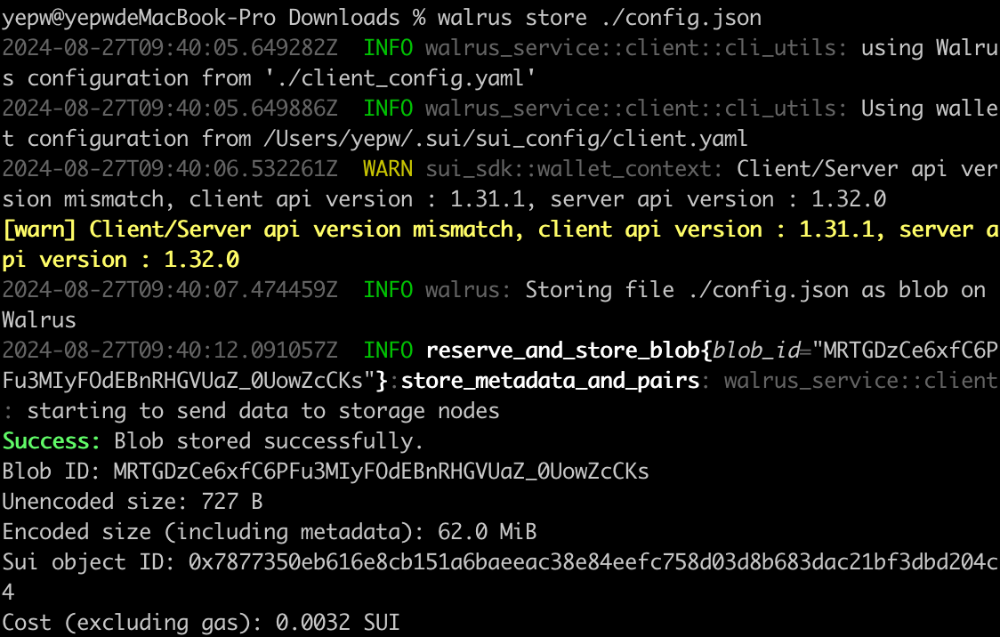
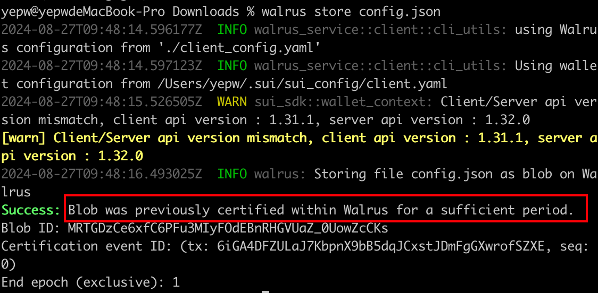
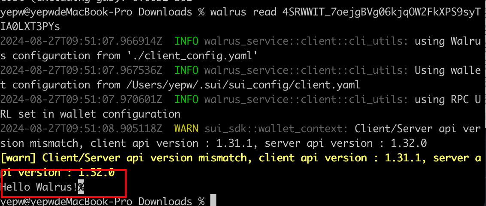
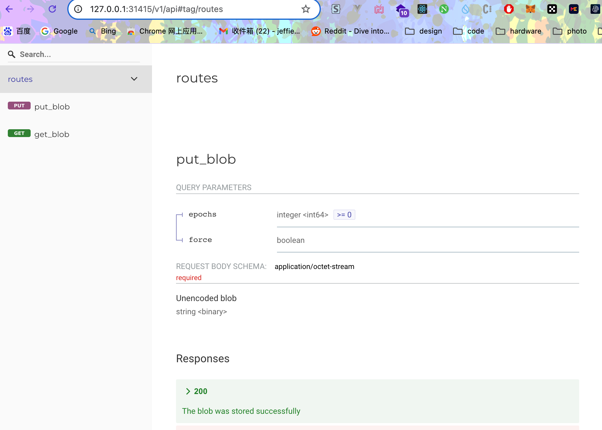
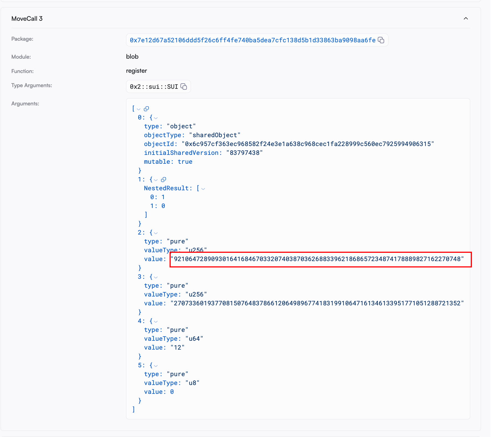

# 使用

Walrus 提供了 3 种与 Walrus 存储系统直接交互的方式：

- 通过 Walrus CLI交互

- 通过 Walrus CLI 的JSON API

- 通过公共HTTP API或是本地守护进程API

## CLI 使用

可通过`walrus info`查看 Walrus 系统相关信息：

```shell
Walrus system information
Current epoch: 0

Storage nodes
Number of nodes: 10
Number of shards: 1000

Blob size
Maximum blob size: 13.3 GiB (14,273,391,930 B)
Storage unit: 1.00 KiB

Approximate storage prices per epoch
Price per encoded storage unit: 50 MIST
Price to store metadata: 0.0031 SUI
Marginal price per additional 1 MiB (w/o metadata): 241,950 MIST

Total price for example blob sizes
16.0 MiB unencoded (135 MiB encoded): 0.0069 SUI per epoch
512 MiB unencoded (2.33 GiB encoded): 0.122 SUI per epoch
13.3 GiB unencoded (60.5 GiB encoded): 3.174 SUI per epoch
```

在 Walrus 上存储 blob 可以通过以下命令来实现：
```shell
walrus store <some file> --epochs <EPOCHS>
```
后面的参数不填默认仅存储一个 epoch,具体一个epoch多长，官方声明目前在 Walrus devnet epoch是固定的，会一直存储，但未来在主网，需要根据你希望访问数据的周期数量付费。

可以通过以下命令之一查询 blob 的状态：
```shell
walrus blob-status --blob-id <BLOB_ID>
walrus blob-status --file <FILE>
```

试着上传一些文件：

- 先上传个小文件：


- 再传个大的图片：


可以发现 Walrus在存储非常小的 blob（比如几个字节）不如图片大小的 blob 高效。

但是你多次上传同一份文件，Walrus不会再次上传文件：



还可以使用`walrus read <some blob ID>`来读取文件内容：



当然在命令行只能显示文本类文件内容，比如图片视频等格式则需要根据其文件类型专门设置才能显示，比如这个官方的HTMl上传文件的[Example](https://github.com/MystenLabs/walrus-docs/tree/main/examples/javascript)，可以在页面上显示上传的图片。

## CLI JSON 使用

存储：
```shell
walrus json \
    '{
        "config": "path/to/client_config.yaml",
        "command": {
            "store": {
                "file": "README.md"
            }
        }
    }'
```

读取：
```shell
walrus json \
    '{
        "config": "path/to/client_config.yaml",
        "command": {
            "read": {
                "blobId": "4BKcDC0Ih5RJ8R0tFMz3MZVNZV8b2goT6_JiEEwNHQo"
            }
        }
    }'
```

## HTTP API 使用

### 本地启动守护进程

使用以下命令设置本地守护进程：
```shell
walrus daemon -b "127.0.0.1:31415"
```
或者在不同的地址/端口上分别运行聚合器和发布器进程:
```shell
walrus aggregator -b "127.0.0.1:31415" # run an aggregator to read blobs
walrus publisher -b "127.0.0.1:31416" # run a publisher to store blobs
```

> 💡 **提示：** 如果在服务器上部署进程，需要注意设置访问权限，aggregator虽然不消耗gas，publisher需要链上操作，是消耗gas的。

浏览器访问守护进程的接口文档：



### 公共HTTP API 使用

对于某些用例（例如，公共网站），或者只是尝试 HTTP API，需要可公开访问的聚合器和/或发布者。Walrus提供了公开访问的API：

- Aggregator: 
    - https://aggregator.walrus-testnet.walrus.space
    - https://wal-aggregator-testnet.staketab.org
    - https://walrus-testnet-aggregator.bartestnet.com
    - https://walrus-testnet.blockscope.net
    - https://walrus-testnet-aggregator.nodes.guru
    - https://walrus-cache-testnet.overclock.run
    - https://sui-walrus-testnet.bwarelabs.com/aggregator
    - https://walrus-testnet-aggregator.stakin-nodes.com
    - https://testnet-aggregator-walrus.kiliglab.io
    - https://walrus-cache-testnet.latitude-sui.com
    - https://walrus-testnet-aggregator.nodeinfra.com
    - https://walrus-tn.juicystake.io:9443
    - https://walrus-agg-testnet.chainode.tech:9002
    - https://walrus-testnet-aggregator.starduststaking.com:11444
    - http://walrus-testnet-aggregator.everstake.one:9000
    - http://walrus.testnet.pops.one:9000
    - http://scarlet-brussels-376c2.walrus.bdnodes.net:9000
    - http://aggregator.testnet.sui.rpcpool.com:9000
    - http://walrus.krates.ai:9000
    - http://walrus-testnet.stakingdefenseleague.com:9000
    - http://walrus.sui.thepassivetrust.com:9000
- Publisher:
    - https://publisher.walrus-testnet.walrus.space
    - https://wal-publisher-testnet.staketab.org
    - https://walrus-testnet-publisher.bartestnet.com
    - https://walrus-testnet-publisher.nodes.guru
    - https://sui-walrus-testnet.bwarelabs.com/publisher
    - https://walrus-testnet-publisher.stakin-nodes.com
    - https://testnet-publisher-walrus.kiliglab.io
    - https://walrus-testnet-publisher.nodeinfra.com
    - https://walrus-testnet.blockscope.net:11444
    - https://walrus-publish-testnet.chainode.tech:9003
    - https://walrus-testnet-publisher.starduststaking.com:11445
    - http://walrus-publisher-testnet.overclock.run:9001
    - http://walrus-testnet-publisher.everstake.one:9001
    - http://walrus.testnet.pops.one:9001
    - http://ivory-dakar-e5812.walrus.bdnodes.net:9001
    - http://publisher.testnet.sui.rpcpool.com:9001
    - http://walrus.krates.ai:9001
    - http://walrus-publisher-testnet.latitude-sui.com:9001
    - http://walrus-tn.juicystake.io:9090
    - http://walrus-testnet.stakingdefenseleague.com:9001
    - http://walrus.sui.thepassivetrust.com:9001
    - https://publisher-devnet.walrus.space

在本地尝试上传：
```shell
AGGREGATOR=https://aggregator.walrus-testnet.walrus.space
PUBLISHER=https://publisher.walrus-testnet.walrus.space

curl -X PUT "$PUBLISHER/v1/store" -d "hello walrus" # store the string `some string` for 1 storage epoch
{
    "newlyCreated": {
        "blobObject": {
            "id": "0x1edf7f949d3a54b83d192ad1cb80f6ef19a09e741bdbeb7b3459f554377dea17", 
            "storedEpoch": 0, 
            "blobId": "HCyYpGgTIU4_mQHGkYpvhcmYa8F79XKeKtXQpo1qoss", 
            "size": 12, 
            "erasureCodeType": "RedStuff", 
            "certifiedEpoch": 0, 
            "storage": {
                "id": "0x3c90e6c9fd5fbada3ed5fb89dd8e92711f391644e43299a17f8d7d7a252d152b", 
                "startEpoch": 0, 
                "endEpoch": 1, 
                "storageSize": 65023000
            }
        }, 
        "encodedSize": 65023000, 
        "cost": 3175000
    }
}
curl -X PUT "$PUBLISHER/v1/store?epochs=5" --upload-file "hello sui" # store file `some/file` for 5 storage epochs

```
返回的blobId可以在 [Sui浏览器](https://testnet.suivision.xyz/object/0x1edf7f949d3a54b83d192ad1cb80f6ef19a09e741bdbeb7b3459f554377dea17)上查看:

### 分析上传的交互细节

- 首先调用System合约的system模块的[reserve_space函数](https://github.com/MystenLabs/walrus-docs/blob/main/contracts/blob_store/sources/system.move#L188)拿到预留存储空间和消耗的Coin：
```rust
/// Allow buying a storage reservation for a given period of epochs.
    public fun reserve_space<WAL>(
        self: &mut System<WAL>,
        storage_amount: u64,
        periods_ahead: u64,
        mut payment: Coin<WAL>,
        ctx: &mut TxContext,
    ): (Storage, Coin<WAL>) {}
```
- 再调用System合约的blob模块的[derive_blob_id函数](https://github.com/MystenLabs/walrus-docs/blob/main/contracts/blob_store/sources/blob.move#L80)派生出blob id，当然这步没有在合约细节中显示，我猜测 Walrus 也可以在链下解析文件并派生出blob id（有大佬有别的理解可以联系我交流呀^ _ ^）
```rust
/// Derive the blob_id for a blob given the root_hash, erasure_code_type and size.
    public fun derive_blob_id(
      root_hash: u256, 
      erasure_code_type: u8, 
      size: u64): u256 {}
```
- 再调用System合约的blob模块的[register函数](https://github.com/MystenLabs/walrus-docs/blob/main/contracts/blob_store/sources/blob.move#L97)拿到Blob对象
```rust
/// Register a new blob in the system.
    /// `size` is the size of the unencoded blob. The reserved space in `storage` must be at
    /// least the size of the encoded blob.
    public fun register<WAL>(
        sys: &System<WAL>,
        storage: Storage,
        blob_id: u256,
        root_hash: u256,
        size: u64,
        erasure_code_type: u8,
        ctx: &mut TxContext,
    ): Blob {}
```

这里传入的blob_id是u256格式的：



可以通过一些[转换工具](https://www.rapidtables.com/convert/number/decimal-to-hex.html?x=92106472890930164168467033207403870362688339621868657234874178889827162270748)来转换下格式，或者直接呼叫AI执行也可以。

```shell
 1. Convert u256 to little endian hexadecimal:     50181912741839464529955351348880556819450364832323162298055522980540262911409 -> b10d8c855635c60fc863a1a3ae7339d25d4c3f6c5a2e0d284988f1f3c1f4f16e

 2. convert hex to url-safe base64 with no padding: 
  b10d8c855635c60fc863a1a3ae7339d25d4c3f6c5a2e0d284988f1f3c1f4f16e -> sQ2MhVY1xg_IY6GjrnM50l1MP2xaLg0oSYjx88H08W4
```

Walrus 官方也认为这样太麻烦，会在未来在CLI中添加对 blob ID 使用u256格式的支持。

- 最后调用System合约的blob模块的[certify函数](https://github.com/MystenLabs/walrus-docs/blob/main/contracts/blob_store/sources/blob.move#L205)做认证签名，到这一步，文件就算是在Walrus的服务器在设置的epoch阶段内可访问了。
```rust
/// Certify that a blob will be available in the storage system until the end epoch of the
    /// storage associated with it.
    public fun certify<WAL>(
        sys: &System<WAL>,
        blob: &mut Blob,
        signature: vector<u8>,
        members: vector<u16>,
        message: vector<u8>,
    ) {}
```