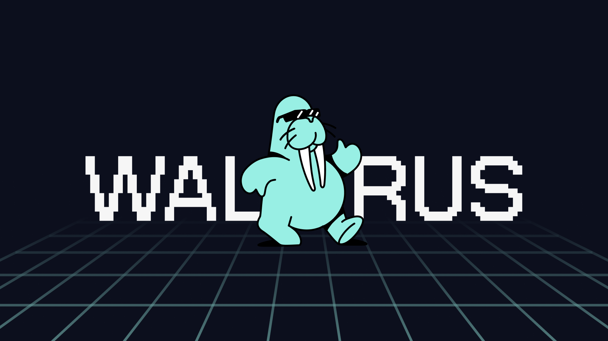

# Sui Walrus 概览

Walrus是一种专门为大型二进制文件设计的去中心化存储和数据可用性协议。 专注于提供强大但经济实惠的解决方案，用于在去中心化存储节点上存储非结构化内容，同时即使在存在拜占庭故障的情况下也能确保其高可用性和可靠性。

## 特点和优势

- **架构**：它将文件分片（称为“slivers”），并通过“shards”将这些分片分布到不同的存储节点。Walrus 强调在每个存储周期内，超过三分之二的存储节点是可靠的，即使有三分之一的节点可能是恶意的，系统也能正常运行。

- **安全且高可用**：Walrus 假设一部分存储节点可能是恶意的，但通过区块链智能合约来管理和分配存储资源，并通过链上验证和证书机制来确保数据的安全性和可用性。

- **读写**：Walrus 支持写入和读取 blob 的存储操作。它还允许任何人证明 blob 已被存储并且可供检索。

- **维持低成本**：通过利用先进的[擦除码](https://zh.wikipedia.org/wiki/%E7%BA%A0%E9%94%99%E7%A0%81)，Walrus 将存储成本维持在存储 Blob 大小的大约五倍，并且每个 Blob 的编码部分存储在每个存储节点上。这比传统的完整复制方法更具成本效益，并且比仅将每个 blob 存储在存储节点子集上的协议更能抵御故障。

- **与Sui集成**：Walrus 利用 Sui 进行协调、证明可用性和支付。存储空间在Sui上表现为一种资源，可以拥有、分割、合并、转让。存储的 blob 也由 Sui 上的对象表示，这意味着智能合约可以检查 blob 是否可用以及可用时间。

- **提供多种访问能力**：用户可以通过命令行界面 (CLI)、软件开发工具包 (SDK) 和 web2 HTTP 技术与 Walrus 进行交互。 Walrus 旨在与传统缓存和内容分发网络 (CDN) 良好配合，同时确保所有操作也可以使用本地工具运行，以最大限度地实现去中心化。

## 应用场景

从上面的介绍可以看出 Walrus 算是 IPFS 和 Filecoin 项目结合体的升级版替代方案，其应用场景可分为：

- **NFT或dApp的媒体存储**： Walrus 可以直接存储和提供图像、声音、精灵、视频、其他游戏资产等媒体。这是公开可用的媒体，可以使用缓存中的 HTTP 请求来访问以创建dApp。

- **区块链历史的长期存档存**：Walrus 可以充当成本较低的去中心化存储来存储区块链历史。对于Sui来说，这可以包括具有所有关联交易和效果内容的检查点序列，以及区块链状态、代码或二进制文件的历史快照。

- **完全去中心化的Web体验**：Walrus 可以托管完全去中心化的Web内容，包括所有资源（例如 js、css、html、媒体）。它们不仅可以提供内容，还可以托管 dApp 的用户体验，使应用程序在链上具有完全去中心化的前端和后端。 Walrus 将完整的“网络”放入web3中。
