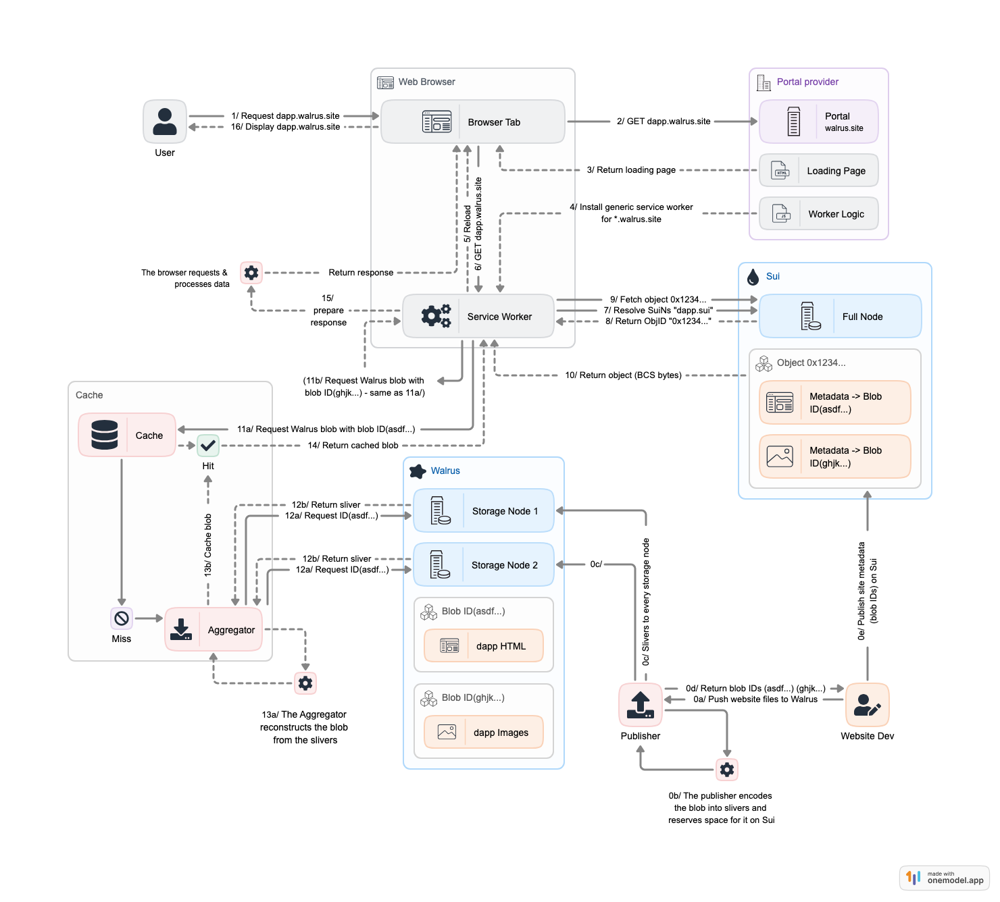

# 深入细节

上一节介绍了 Walrus Sites 的使用，虽然有那么点麻烦，但是部署的网站真正做到了Puts the full "web" into Web3，还是挺酷的，下面分析下 site_builder 部署网站的流程。

## 部署流程

Walrus Sites 的资源（ html 、 css 、 js 、图像等）存储在 Walrus 上，而其主要入口点是存储在 Sui 上的一个对象，该对象包含节点的元数据并指向 Walrus 上存储的文件的 blob id。

Walrus Sites 已经在存储节点有了部署的资源，也在 Sui 链上映射了对应的blob ids，问题是如何在浏览器上渲染：

Walrus 采用了 Service Worker的方法，将Service Worker的监听放在Portal上，目前是walrus.site，当加载二级域名时，在客户端生成Service Worker的逻辑，请求 Sui 链的元数据和 Walrus 的数据信息展示。

> 💡 **提示：** Walrus使用 “Portal” 来表示用于访问浏览 Walrus 站点的任何技术，目前只有基于 service-worker 的 Portal 可用。

下面是关于 Walrus 网站如何部署的流程图：



- 部署网站（step 0）：站点开发人员使用site-builder发布 Walrus 站点。
- 浏览器请求（step 1）: 浏览器请求站点。
- 安装Service Worker（step 2-6）：浏览器连接到托管在walrus.site的Portal，Portal响应一个为dapp.walrus.site安装 Service Worker 的页面。刷新页面以激活 Service Worker。
- 网站解析（step 7-10）：在客户端安装的 Service Worker 解析origin `dapp.walrus.site` ，并对dapp.sui进行 SuiNS 解析，获取相关对象 ID。然后使用对象 ID 获取对象的动态字段（同时检查重定向）。从动态字段中选择/index.html字段，并提取其 Walrus blob ID 和内容类型。
- 获取 Blob 对象数据 (steps 11-14) ：通过blob ID，Service Worker 会在 Walrus 聚合器中查询该 blob 对象。
- 返回响应 (steps 15-16) ：Service Worker 通过/index.html的字节及其content_type ，返回内容然后由浏览器呈现。

## 合约解析

部署一个普通的静态网站到浏览器在 web2 是相对比较简单的流程，网站域名解析服务器下的目录文件即可，更别说现在有许多类似 Vercel 的工具提供全自动化的网站部署。

如果需要将整个前端文件维护在 web3 的世界里，如果只是上传文件，那 Walrus 就足够了，但是网站需要维护多个文件之间的关系，并根据这些关系在浏览器上渲染，Walrus 维护了一个 [site](https://github.com/MystenLabs/walrus-sites/blob/main/move/walrus_site/sources/site.move) 合约，定义了一系列结构表示网站的资源：

- Site 的结构很简单，id和网站名称
```rust
/// The site published on Sui.
    struct Site has key, store {
        id: UID,
        name: String,
    }
```
- 与 Site 关联的资源将作为 Resource 类型的动态字段添加到该对象中，
每个 Resource 包含：

  - Resource 的 `path` ，例如/index.html （所有路径始终表示为从 跟路径 /开始）
  - Resource 的 `content_type` ，例如text/html
  - Resource 的 `content_encoding` （目前唯一可用的值是plaintext）
  - Resource 的 `blob_id`，这是可以在存储节点中找到资源的 Walrus blob ID
```rust
/// A resource in a site.
    struct Resource has store, drop {
        path: String,
        content_type: String,
        content_encoding: String,
        // The walrus blob id containing the bytes for this resource
        blob_id: u256,
    }
```

- 通过 ResourcePath 类型作为 Resource 动态字段的key，确保不会与其他包添加的动态字段发生命名空间冲突
```rust
/// Representation of the resource path.
    ///
    /// Ensures there are no namespace collisions in the dynamic fields.
    struct ResourcePath has copy, store, drop {
        path: String,
    }
```

合约提供了一些函数控制网站资源的CRUD:
```rust
public fun new_site(name: String, ctx: &mut TxContext): Site {}
public fun new_resource(
        path: String,
        content_type: String,
        content_encoding: String,
        blob_id: u256,
    ): Resource {}
fun new_path(path: String): ResourcePath {}
public fun update_name(site: &mut Site, new_name: String) {}
public fun add_resource(site: &mut Site, resource: Resource) {}
public fun remove_resource(site: &mut Site, path: String): Resource {}
public fun remove_resource_if_exists(site: &mut Site, path: String): Option<Resource> {}
public fun move_resource(site: &mut Site, old_path: String, new_path: String) {}
```

## site_builder解析

site_builder 的 [源码](https://github.com/MystenLabs/walrus-sites/tree/main/site-builder) 是Rust写的一个CLI工具，供用户在本地上传部署自己的Site。

根据`publish`命令的log信息，当我们提交需要部署的Site文件时：

- 运行site_builder cli publish 命令 执行main.rs的 [run函数](https://github.com/MystenLabs/walrus-sites/blob/main/site-builder/src/main.rs#L203)，运行不同的命令 其中主要是publish update 和 convert，咱们主要看下 publish 的流程

- 首先获取命令中的`--config`参数信息
```rust
let args = Args::parse();
    let mut config: Config = std::fs::read_to_string(&args.config)
        .context(format!(
            "unable to read config {:?}; consider using the --config flag to point to the config",
            args.config
        ))
        .and_then(|s| {
            serde_yaml::from_str(&s)
                .context(format!("unable to parse yaml in file {:?}", args.config))
        })?;
    // Merge the configs and the CLI args. Serde default ensures that the `walrus_binary` and
    // `gas_budget` exist.
    config.merge(&args.general);
```

- 然后获取命令行中的参数：
```shell
Options:
  -e, --content-encoding <CONTENT_ENCODING>  The encoding for the contents of the site's resources [default: plaintext]
                                             [possible values: plaintext]
      --epochs <EPOCHS>                      The number of epochs for which to save the resources on Walrus [default: 1]
      --list-directory                       Preprocess the directory before publishing. See the `list-directory` command.
                                             Warning: Rewrites all `index.html` files
  -s, --site-name <SITE_NAME>                The name of the site [default: "test site"]
```

```rust
/// Publish a new site on Sui.
Publish {
    #[clap(flatten)]
    publish_options: PublishOptions,
    /// The name of the site.
    #[clap(short, long, default_value = "test site")]
    site_name: String,
},

#[derive(Parser, Debug, Clone)]
pub struct PublishOptions {
    /// The directory containing the site sources.
    pub directory: PathBuf,
    #[clap(short = 'e', long, value_enum, default_value_t = ContentEncoding::PlainText)]
    /// The encoding for the contents of the site's resources.
    pub content_encoding: ContentEncoding,
    /// The number of epochs for which to save the resources on Walrus.
    #[clap(long, default_value_t = 1)]
    pub epochs: u64,
    /// Preprocess the directory before publishing.
    /// See the `list-directory` command. Warning: Rewrites all `index.html` files.
    #[clap(long, action)]
    pub list_directory: bool,
}
```

- 获取了所有参数后执行publish_site方法，内部直接异步执行    [edit_site函数](https://github.com/MystenLabs/walrus-sites/blob/main/site-builder/src/publish.rs#L137)

```rust
match args.command {
        Commands::Publish {
            publish_options,
            site_name,
        } => publish_site(publish_options, site_name, &config).await?,
}

pub async fn publish_site(
    publish_options: PublishOptions,
    site_name: String,
    config: &Config,
) -> Result<()> {
    edit_site(
        &publish_options.directory,
        &publish_options.content_encoding,
        SiteIdentifier::NewSite(site_name),
        config,
        publish_options.epochs,
        false,
        publish_options.list_directory,
    )
    .await
}
```

- edit_site函数先获取本地钱包信息：
```rust
let wallet = load_wallet_context(&config.general.wallet)?;

#[allow(dead_code)]
pub fn load_wallet_context(path: &Option<PathBuf>) -> Result<WalletContext> {
    let mut default_paths = vec!["./client.yaml".into(), "./sui_config.yaml".into()];
    if let Some(home_dir) = home::home_dir() {
        default_paths.push(home_dir.join(".sui").join("sui_config").join("client.yaml"))
    }
    let path = path_or_defaults_if_exist(path, &default_paths)
        .ok_or(anyhow!("Could not find a valid wallet config file."))?;
    tracing::info!("Using wallet configuration from {}", path.display());
    WalletContext::new(&path, None, None)
}
```

- 再实例化 Walrus CLI
```rust
let walrus = Walrus::new(
    config.walrus_binary(),
    config.gas_budget(),
    config.general.rpc_url.clone(),
    config.general.walrus_config.clone(),
    config.general.wallet.clone(),
);

/// Creates a new Walrus CLI controller.
pub fn new(
    bin: String,
    gas_budget: u64,
    rpc_url: Option<String>,
    config: Option<PathBuf>,
    wallet: Option<PathBuf>,
) -> Self {
    Self {
        bin,
        gas_budget,
        rpc_url,
        config,
        wallet,
    }
}
```

- 实例化一个resource manager, 准备存储上传的文件
```rust
let mut resource_manager = ResourceManager::new(walrus.clone())?;

pub fn new(walrus: Walrus) -> Result<Self> {
    Ok(ResourceManager {
        walrus,
        resources: ResourceSet::default(),
    })
}
```

- 递归读取文件
```rust
resource_manager.read_dir(directory, content_encoding)?;

/// Recursively iterate a directory and load all [`Resources`][Resource] within.
pub fn read_dir(&mut self, root: &Pathcontent_encoding: &ContentEncoding) -> Result<()> {
    self.resources = ResourceSet::from_iter(self.iter_d(root, root, content_encoding)?);
    Ok(())
}

fn iter_dir(
    &self,
    start: &Path,
    root: &Path,
    content_encoding: &ContentEncoding,
) -> Result<Vec<Resource>> {
    let mut resources: Vec<Resource> = vec![];
    let entries = fs::read_dir(start)?;
    for entry in entries.flatten() {
        let path = entry.path();
        if path.is_dir() {
            resources.extend(self.iter_dir(&path, root, content_encoding)?);
        } else if let Some(res) =
            self.read_resource(&path, root, content_encoding)
                .context(format!(
                    "error while reading resource `{}`",
                    path.to_string_lossy()
                ))?
        {
            resources.push(res);
        }
    }
    Ok(resources)
}

/// Read a resource at a path.
    ///
    /// Ignores empty files.
    pub fn read_resource(
        &self,
        full_path: &Path,
        root: &Path,
        content_encoding: &ContentEncoding,
    ) -> Result<Option<Resource>> {
        let extension = full_path.extension().unwrap_or(
            full_path
                .file_name()
                .expect("the path should not terminate in `..`"),
        );

        let content_type =
            match ContentType::try_from_extension(extension.to_str().ok_or(anyhow!(
                "Could not convert the extension {:?} to a string.",
                extension.to_string_lossy()
            ))?) {
                Ok(content_type) => content_type,
                Err(_) => {
                    tracing::warn!(
                        "The extension {} string for file {} could not be decoded.
                        Defaulting to arbitrary binary content type: octet-stream.",
                        extension.to_string_lossy(),
                        full_path.to_string_lossy()
                    );
                    ContentType::ApplicationOctetstream // arbitrary binary data RFC 2046
                }
            };

        let plain_content = std::fs::read(full_path)?;
        // TODO(giac): this could be (i) async; (ii) pre configured with the number of shards to
        //     avoid chain interaction (maybe after adding `info` to the JSON commands).
        let output = self.walrus.blob_id(full_path.to_owned(), None)?;

        // TODO(giac): How to encode based on the content encoding? Temporary file? No encoding?
        //     let content = match content_encoding {
        //         ContentEncoding::PlainText => plain_content,
        //         ContentEncoding::Gzip => compress(&plain_content)?,
        //     };

        Ok(Some(Resource::new(
            full_path_to_resource_path(full_path, root)?,
            full_path.to_owned(),
            content_type,
            *content_encoding,
            output.blob_id,
            // TODO(giac): Change to `content.len()` when the problem with content encoding is
            // fixed.
            plain_content.len(),
        )))
    }
```

- 可以看到上面读取文件的代码还挺复杂的，而且有一部分还在TODO状态，先不详细介绍了（~~太菜了看不懂~~）

- 实例化一个site manager
```rust
let site_manager = SiteManager::new(
    config.clone(),
    walrus,
    wallet,
    site_id.clone(),
    epochs,
    force,
)
.await?;

/// Creates a new site manager.
pub async fn new(
    config: Config,
    walrus: Walrus,
    wallet: WalletContext,
    site_id: SiteIdentifier,
    epochs: u64,
    force: bool,
) -> Result<Self> {
    Ok(SiteManager {
        walrus,
        wallet,
        config,
        site_id,
        epochs,
        force,
    })
}
```

- 与site合约交互，如果有site_id，更新site资源；如果没有创建新的site；然后diff处理resource，将有更新的资源传到walrus:
```rust
/// Updates the site with the given [`Resource`](super::resource::Resource).
    ///
    /// If the site does not exist, it is created and updated. The resources that need to be updated
    /// or created are published to Walrus.
    pub async fn update_site(
        &self,
        resources: &ResourceManager,
    ) -> Result<(SuiTransactionBlockResponse, OperationsSummary)> {
        let ptb = SitePtb::new(
            self.config.package,
            Identifier::from_str(SITE_MODULE).expect("the str provided is valid"),
        )?;
        let (ptb, existing_resources, needs_transfer) = match &self.site_id {
            SiteIdentifier::ExistingSite(site_id) => (
                ptb.with_call_arg(&self.wallet.get_object_ref(*site_id).await?.into())?,
                self.get_existing_resources(*site_id).await?,
                false,
            ),
            SiteIdentifier::NewSite(site_name) => (
                ptb.with_create_site(site_name)?,
                ResourceSet::default(),
                true,
            ),
        };
        tracing::debug!(?existing_resources, "checked existing resources");
        let update_operations = if self.force {
            existing_resources.replace_all(&resources.resources)
        } else {
            resources.resources.diff(&existing_resources)
        };
        tracing::debug!(operations=?update_operations, "list of operations computed");

        self.publish_to_walrus(&update_operations).await?;

        if !update_operations.is_empty() {
            display::action("Updating the Walrus Site object on Sui");
            let result = self
                .execute_updates(ptb, &update_operations, needs_transfer)
                .await?;
            display::done();
            return Ok((result, update_operations.into()));
        }
        // TODO(giac) improve this return
        Ok((
            SuiTransactionBlockResponse::default(),
            update_operations.into(),
        ))
    }

pub fn with_call_arg(mut self, site_arg: &CallArg) -> Result<SitePtb<Argument>> {
        let site_argument = self.pt_builder.input(site_arg.clone())?;
        Ok(SitePtb {
            pt_builder: self.pt_builder,
            site_argument,
            package: self.package,
            module: self.module,
        })
    }

/// Makes the call to create a new site and keeps the resulting argument.
pub fn with_create_site(mut self, site_name: &str)  -> Result<SitePtb<Argument>> {
    let argument = self.create_site(site_name)?;
    self.with_arg(argument)
}

/// Move call to create a new Walrus site.
pub fn create_site(&mut self, site_name: &str) -> Result<Argument> {
    tracing::debug!(site=%site_name, "new Move call creating site");
    let name_arg = self.pt_builder.input(pure_call_argsite_name)?)?;
    Ok(self.add_programmable_move_call(Identifier::new("new_site")?, vec![], vec![name_arg]))
}

/// Publishes the resources to Walrus.
async fn publish_to_walrus<'b>(&self, updates: &[ResourceOp<'b>]) -> Result<()> {
        let to_update = updates
            .iter()
            .filter(|u| matches!(u, ResourceOp::Created(_)))
            .collect::<Vec<_>>();
        tracing::debug!(resources=?to_update, "publishing new or updated resources to Walrus");

        for update in to_update.iter() {
            let resource = update.inner();
            tracing::debug!(
                resource=?resource.full_path,
                blob_id=%resource.info.blob_id,
                unencoded_size=%resource.unencoded_size,
                "storing new blob on Walrus"
            );
            display::action(format!(
                "Storing resource on Walrus: {}",
                &resource.info.path
            ));
            let _output = self
                .walrus
                .store(resource.full_path.clone(), self.epochs, self.force)?;
            display::done();
        }
        Ok(())
    }
```

## 参考资料

[Walrus 文档](https://mystenlabs.github.io/walrus-docs/index.html)

[Walrus Discord](https://discord.com/invite/walrusprotocol)

[Walrus Source Code](https://github.com/MystenLabs/walrus-docs)

[Henry Walrus 主题分享](https://www.youtube.com/watch?v=qr64mSIMfLs)


