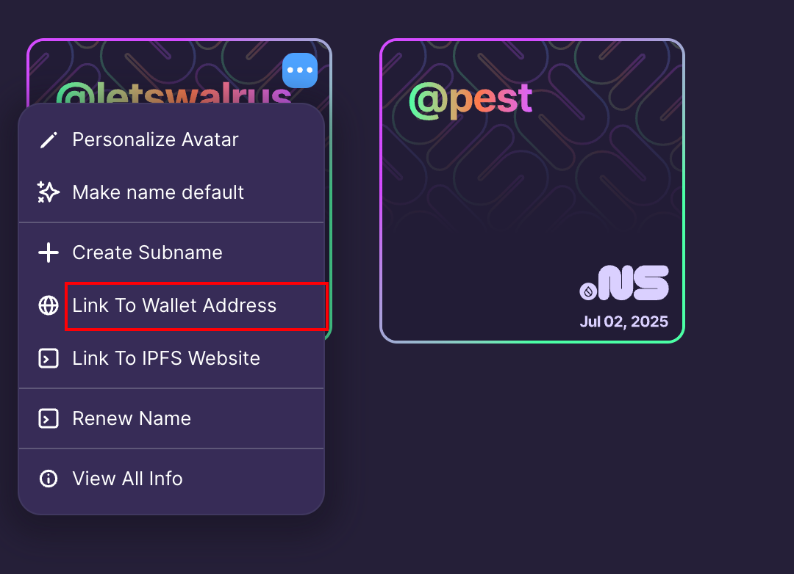

# 部署

Walrus 官方做了一个 [site_builder](https://github.com/MystenLabs/walrus-sites/tree/main/site-builder) 的工具可以把任意前端源文件，比如任意前端框架打包生成的dist文件或是原生html文件发送到 Walrus 节点，通过Walrus site合约的 [new_site函数](https://github.com/MystenLabs/walrus-sites/blob/main/move/walrus_site/sources/site.move#L32C16-L32C24) 生成的object_id转换成base36格式作为walrus.site的二级域名供用户访问，例如`https://29gjzk8yjl1v7zm2etee1siyzaqfj9jaru5ufs6yyh1yqsgun2.walrus.site`，后面会详细分析部署网站流程。

并且 Walrus 还可以使用 SuiNS 名称（这类似于 Sui 的 DNS）为 Walrus 站点分配人类可读的名称。为此，您只需获取您喜欢的 SuiNS 名称，并将其指向 Walrus 站点的对象 ID（由publish或update命令提供）。

## 安装

首先保证本地 Rust 更新到最新：
```shell
rustup update stable
```
并且已安装 git, Walrus，再从git上下载site_builder
```shell
git clone https://github.com/MystenLabs/walrus-sites.git
cd walrus-sites
```
然后打包构建site_builder：
```shell
cargo build --release
```
构建后打包的文件在：
```shell
./target/release/site-builder
```

## 部署

部署比较简单，但上传比较大的文件速度还是比较慢的，需要确保本地的钱包地址的gas是否足够，这里尝试把本文档传到 Walrus:
```shell
yepw@yepwdeMacBook-Pro walrus-sites % ./target/release/site-builder --config site-builder/assets/builder-example.yaml publish ../../web3/move-project/letswalrus/build 
Parsing the directory ../../web3/move-project/letswalrus/build and locally computing blob IDs ... [Ok]
Storing resource on Walrus: /.nojekyll ... [Ok]
Storing resource on Walrus: /404.html ... [Ok]
Storing resource on Walrus: /assets/css/styles.8c691e1f.css ... [Ok]
Storing resource on Walrus: /assets/images/daemon-2b638fb1f3cf141dfefbb7ff3fc909f3.png ... [Ok]
Storing resource on Walrus: /assets/images/store_1-5b3d59164dff542c8efe47a70996c7c4.png ... [Ok]
Storing resource on Walrus: /assets/images/store_2-e4864c48dc51efcc9185c8933279c482.png ... [Ok]
Storing resource on Walrus: /assets/images/store_3-360e86d084e09d9c70d6d3b0d7c3e002.png ... [Ok]
Storing resource on Walrus: /assets/images/store_4-9a4d4f7de91c08e2e2f25285400096dd.png ... [Ok]
Storing resource on Walrus: /assets/images/store_5-b520adaffa292463f309262689d4980d.png ... [Ok]
Storing resource on Walrus: /assets/images/system-e7b7126a7b63ac825a4f8753a0b09ccc.png ... [Ok]
Storing resource on Walrus: /assets/images/walrus-16ed09636ccefec88b9ed2bf48c7930d.png ... [Ok]
Storing resource on Walrus: /assets/images/walrus_write_flow-e744be6f13d999757c37c8dd0a82716b.png ... [Ok]
Storing resource on Walrus: /assets/js/0058b4c6.f36d3735.js ... [Ok]
Storing resource on Walrus: /assets/js/0e384e19.9e067ddf.js ... [Ok]
Storing resource on Walrus: /assets/js/17896441.bfe7921e.js ... [Ok]
Storing resource on Walrus: /assets/js/18a2ead1.2beb8ed8.js ... [Ok]
Storing resource on Walrus: /assets/js/1df93b7f.b31f3445.js ... [Ok]
Storing resource on Walrus: /assets/js/1f391b9e.13aaee87.js ... [Ok]
Storing resource on Walrus: /assets/js/30bc47fc.6fbd108c.js ... [Ok]
Storing resource on Walrus: /assets/js/393be207.69f504ad.js ... [Ok]
Storing resource on Walrus: /assets/js/5e95c892.99c2dd6c.js ... [Ok]
Storing resource on Walrus: /assets/js/618.58d5475e.js ... [Ok]
Storing resource on Walrus: /assets/js/748c7864.47f041a8.js ... [Ok]
Storing resource on Walrus: /assets/js/769.bc6172fc.js ... [Ok]
Storing resource on Walrus: /assets/js/8dc1f96f.ebbc58df.js ... [Ok]
Storing resource on Walrus: /assets/js/a7456010.7c012690.js ... [Ok]
Storing resource on Walrus: /assets/js/a7bd4aaa.fe724026.js ... [Ok]
Storing resource on Walrus: /assets/js/a94703ab.9d8d7144.js ... [Ok]
Storing resource on Walrus: /assets/js/aba21aa0.bdd67c3e.js ... [Ok]
Storing resource on Walrus: /assets/js/c5d45fa4.366b914c.js ... [Ok]
Storing resource on Walrus: /assets/js/e16bd1c9.ed2fa819.js ... [Ok]
Storing resource on Walrus: /assets/js/ff8e39f1.b369c1d7.js ... [Ok]
Storing resource on Walrus: /assets/js/main.0fbda6e7.js ... [Ok]
Storing resource on Walrus: /assets/js/main.0fbda6e7.js.LICENSE.txt ... [Ok]
Storing resource on Walrus: /assets/js/runtime~main.483e6247.js ... [Ok]
Storing resource on Walrus: /docs/arch/architecture/index.html ... [Ok]
Storing resource on Walrus: /docs/arch/concepts/index.html ... [Ok]
Storing resource on Walrus: /docs/arch/encode/index.html ... [Ok]
Storing resource on Walrus: /docs/arch/operation/index.html ... [Ok]
Storing resource on Walrus: /docs/install_and_use/install/index.html ... [Ok]
Storing resource on Walrus: /docs/install_and_use/use/index.html ... [Ok]
Storing resource on Walrus: /docs/intro/index.html ... [Ok]
Storing resource on Walrus: /docs/walrus_sites/publish/index.html ... [Ok]
Storing resource on Walrus: /img/favicon.ico ... [Ok]
Storing resource on Walrus: /img/logo.png ... [Ok]
Storing resource on Walrus: /img/logo.svg ... [Ok]
Storing resource on Walrus: /img/undraw_docusaurus_mountain.svg ... [Ok]
Storing resource on Walrus: /img/undraw_docusaurus_react.svg ... [Ok]
Storing resource on Walrus: /img/undraw_docusaurus_tree.svg ... [Ok]
Storing resource on Walrus: /index.html ... [Ok]
Storing resource on Walrus: /markdown-page/index.html ... [Ok]
Storing resource on Walrus: /sitemap.xml ... [Ok]
Updating the Walrus Site object on Sui ... [Ok]
on mismatch, client api version : 1.27.2, server api version : 1.32.0
Execution completedr api version mismatch, client api version : 1.27.2, server api version : 1.32.0
Operations performed:
  - created resource /.nojekyll with blob ID yn3N65Jszt-YDU4zpmCixT2fdh4FGF1-WjLXt0rmsPE
  - created resource /404.html with blob ID xWIpa0HgH8gozgMBAo5JF17L6tKK5MT9kdDRecUSdLw
  - created resource /assets/css/styles.8c691e1f.css with blob ID Fh1t_lAZBuBC9CGU_dJ0HLLCY2ACE1npRHvMmtsOBPM
  - created resource /assets/images/daemon-2b638fb1f3cf141dfefbb7ff3fc909f3.png with blob ID RcCdB2-AfphyV2vCzlJsYOtY4L_p8nsxRt_PQr42xRc
  - created resource /assets/images/store_1-5b3d59164dff542c8efe47a70996c7c4.png with blob ID GQTq2fvzs1CPgVyBiWHSKu2nXyDMoJQevjYg7U9uprA
  - created resource /assets/images/store_2-e4864c48dc51efcc9185c8933279c482.png with blob ID kGSSU3XdQA3ol7z4sSNcyeqbr08f1DG_4-uY45iap60
  - created resource /assets/images/store_3-360e86d084e09d9c70d6d3b0d7c3e002.png with blob ID p3-0aP_pLpc9Uvtau11_nV_JJMTscwNipEVdXGwn1r0
  - created resource /assets/images/store_4-9a4d4f7de91c08e2e2f25285400096dd.png with blob ID pTOP65KGSPDtwHxqSqJ0mjDSeilnvC39GBstPb5bcTQ
  - created resource /assets/images/store_5-b520adaffa292463f309262689d4980d.png with blob ID 8taT09diZNlBDu23NdoGW9RXEsu-l1nxN7a54JvPijo
  - created resource /assets/images/system-e7b7126a7b63ac825a4f8753a0b09ccc.png with blob ID 96glim0CuCv33fBLPTmX0u2Xd8Llb16nrjNydwCK780
  - created resource /assets/images/walrus-16ed09636ccefec88b9ed2bf48c7930d.png with blob ID TOK93R5nNjhAn4g7R7rtj-iQQEHn6CqsSDv6S3PJ6vw
  - created resource /assets/images/walrus_write_flow-e744be6f13d999757c37c8dd0a82716b.png with blob ID dmzyYa0pbl7lUCC1WyQgCKhzNBNOcwxkYDMz1F7Om4E
  - created resource /assets/js/0058b4c6.f36d3735.js with blob ID T8UvLVU6TIRJdaabABoKueK3EWd2H6-RDT0a4wxPaY8
  - created resource /assets/js/0e384e19.9e067ddf.js with blob ID C4F8EqxVLB5q3oOLbXHLIEDKmsLywQWfiVDRfzmbczg
  - created resource /assets/js/17896441.bfe7921e.js with blob ID SjCchsjiuzZS11eIWW0LCUTAXXK4BxvaCCr5G8_RCtQ
  - created resource /assets/js/18a2ead1.2beb8ed8.js with blob ID Mley0KFl_g4JNy56RzrvfHZ-bMSouTM7Z3ypxfj-ZgI
  - created resource /assets/js/1df93b7f.b31f3445.js with blob ID v-F8V_mEo_-vcWcg4B0IcLHnBWSWOf3Qj4tndJ9IfAc
  - created resource /assets/js/1f391b9e.13aaee87.js with blob ID PO-89lk0kBFP2HSPA5eZZk3Ts3LTOZLxv6Z6kZ1Vq5E
  - created resource /assets/js/30bc47fc.6fbd108c.js with blob ID 5urrf2GZZEVnWYY_Ef0Z2P9wZ8faq3Y3hUK5BvM84oU
  - created resource /assets/js/393be207.69f504ad.js with blob ID or-IW-0jtTcsB8xqDOikQiBZWVClovhYM05ZUdNy-sA
  - created resource /assets/js/5e95c892.99c2dd6c.js with blob ID O5SRM1BvVyFd4U9obZYVRVFRxTX4pk9oue-DbteUAug
  - created resource /assets/js/618.58d5475e.js with blob ID GU8z3s6IcbKDPWkDaTqlzPrBykuZwu5ARdwB479U8hQ
  - created resource /assets/js/748c7864.47f041a8.js with blob ID 97kCdoDY8Nmu4NXiNyik7vMyIrkk-OEmWCsi84GGhZE
  - created resource /assets/js/769.bc6172fc.js with blob ID gqAnA6A0N7VBDQyfwW-BjlQMQ_1b6AGsK_nHYF6jiDU
  - created resource /assets/js/8dc1f96f.ebbc58df.js with blob ID wBa0ZH7x9HYGc_1glxFH66AQnKU3aHVNmJj-e4CZaUU
  - created resource /assets/js/a7456010.7c012690.js with blob ID T_3RPlKYx66SG7mi3WI1OFdoOwAFa3OZk3co-BZ5GZA
  - created resource /assets/js/a7bd4aaa.fe724026.js with blob ID wSjtBDAxB9c1IgplXEmtEagI4aKJWpbiNPOpmKPDYQo
  - created resource /assets/js/a94703ab.9d8d7144.js with blob ID OuUi79f5rU3fbZzAEus_syE2IMturVFzB91fr4o0C9Y
  - created resource /assets/js/aba21aa0.bdd67c3e.js with blob ID bm4eU6yuvDkoy4a9FyNfRck2HDOogl6rgess_d1wXgI
  - created resource /assets/js/c5d45fa4.366b914c.js with blob ID rBBZiu_4X75t5CL7YzCaRRX3wolXslTgU5nt0lZBZmk
  - created resource /assets/js/e16bd1c9.ed2fa819.js with blob ID rPkfGs5wC6z_t2TKdnEcYgX9rjL3RniUhkPbyGDNZbE
  - created resource /assets/js/ff8e39f1.b369c1d7.js with blob ID s_y7OP_8izHP-ake81R7wJrlllJsoDzc4RGhxnsrokc
  - created resource /assets/js/main.0fbda6e7.js with blob ID D8mnBx40I4waNgw1zVL5qDsxjBXe49J11dPRogGE1WU
  - created resource /assets/js/main.0fbda6e7.js.LICENSE.txt with blob ID MVVudU58JYbJLzqy2Vo4iKQDkLjZSb-OOvQ0kJp5XUA
  - created resource /assets/js/runtime~main.483e6247.js with blob ID fyQMhqoT--EWOm7B7HMx-HEOfn19Y2mBoJBXEjEZlxU
  - created resource /docs/arch/architecture/index.html with blob ID pPF9cjPb_DEq5EPT32ux6cAcGFOAtCaBBwc-pfUe_mE
  - created resource /docs/arch/concepts/index.html with blob ID 8tqDYHZJBOYN1IHvxNGacsOnVvucNkLJ5boLCNgCVUs
  - created resource /docs/arch/encode/index.html with blob ID Vuq-s8KbEdhsQzYQG0zYhK8-gxdARDV9PbPJKn5BMiQ
  - created resource /docs/arch/operation/index.html with blob ID LFWrMCGtK_P39M3ktcGFzSxVpQ3pIT9Ols79-bmDb1U
  - created resource /docs/install_and_use/install/index.html with blob ID JQ9kBX23vFxfwG6Ewe1AJMilwMdElVE6jmia3w09ZAc
  - created resource /docs/install_and_use/use/index.html with blob ID cvPhsR_ahUNx-vT4PDsrS9mXCZgcYVAV0qUep3sMqfQ
  - created resource /docs/intro/index.html with blob ID 1PBiXFy1xZFQ5535WzJFFCoDtB1b3_lUvvcYRcreQSY
  - created resource /docs/walrus_sites/publish/index.html with blob ID Ec4QPmsb6iyrFrWREpKP5Kr2ckJ5iPcUMGBbzsVq8EQ
  - created resource /img/favicon.ico with blob ID OiFonFmanyVMUmIVimRmfrp_iqjcLaa646HPYXuuq3k
  - created resource /img/logo.png with blob ID OiFonFmanyVMUmIVimRmfrp_iqjcLaa646HPYXuuq3k
  - created resource /img/logo.svg with blob ID 5jYWEyFbc-l3yHoolD3EqBdWc24pLQbZ_SRqyrQYjKA
  - created resource /img/undraw_docusaurus_mountain.svg with blob ID HadtwFIszw-Hc6bruBGLr6N74wvzmUbAZDF9AFjTJBo
  - created resource /img/undraw_docusaurus_react.svg with blob ID VRyJvLQtfApF1fSi4vmEsGmpONdzB-v5kqwOtuW45zg
  - created resource /img/undraw_docusaurus_tree.svg with blob ID aDzgSMRYzLsyXPmvMfM1hXyjVbSLMGS64z9Nz6zvEB0
  - created resource /index.html with blob ID N1gjgm7BbzzTtq9Dy5ZlpIraQ4yIyKqpbbT50jdGh1M
  - created resource /markdown-page/index.html with blob ID JNLtu7noR2QivU4jZX_6LmLXHKnfLjh55yi5TmTSN8M
  - created resource /sitemap.xml with blob ID JFKQMfcxONc4gqtpJ6FIqHEr21DWk_KmBFrDPVQ4K-0

Created new site: test site
New site object ID: 0x64a3d626918666b1e6b141a8db8026c30f9cd1af0c7f55c7521c56af15404161
Browse the resulting site at: https://2iat9cymvomzmwzxm8j0guh0qz8aruauu9m0rlktfcbwmfl1ep.walrus.site
```

最后可以通过这个生成的网址访问本文档。

## 设置SuiNS
可以理解为和前端上传打包代码到Vercel，Vercel也是提供修改二级域名的功能，只是在 Walrus 目前稍微麻烦一点，需要在测试网购买 SuiNS 并绑定部署网站的object id，下面尝试给本文档设置个`letswalrus`的二级域名。

在 [测试网SuiNS](https://testnet.suins.io/) 购买SuiNS，然后在 [SuiNS 展示页面](https://testnet.suins.io/account/my-names) 绑定网站的object id:



上面的网址就可以使用 [letswalrus.walrus.site](https://letswalrus.walrus.site) 访问啦～

> 💡 **提示：** 对于已经上传到 Walrus 的网站，想要更新内容重新上传，最好使用`update`命令，否则 site_builder 会重新上传，导致生成一个新的object id，这样你就需要重新绑定 SuiNS 的object id。


